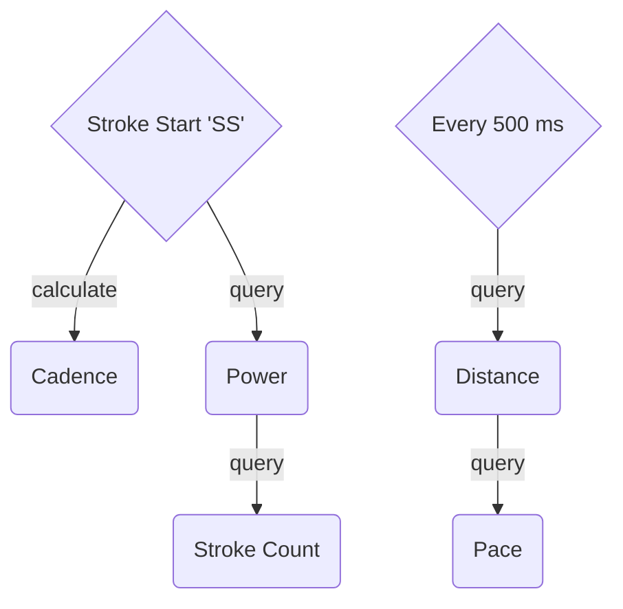

# WaterRower

Ever wanted to read out the data from your WaterRower and maybe even record and display it?

## Features

1. [Capturing live data from the WaterRower S4 computer.](#live-data-capture)
2. [Providing a live dashboard with the most important information.](#live-dashboard)
3. [Recording an activity to a FIT-compatible CSV.](#fit-activity)

### Live Data Capture

The data is being read out based on a certain sequence which keeps the reading stable:



With every new data point, the data is also published to MQTT.

### Live Dashboard

The dashboard shows live information about the following metrics:

- Distance
- Stroke count
- Stroke rate (with chart)
- 500 m pace
- Maximum power
- Last stroke power (with chart)


### FIT Activity

On every first stroke after starting the program, an activity is being recorded into the `trainings` folder in a CSV format. These CSV files can be converted into [FIT files](https://developer.garmin.com/fit/overview/) using the [FitCSVTool](https://developer.garmin.com/fit/fitcsvtool/) and with the following command:

```bash
$ java -jar FitCSVTool.jar -c INPUT.csv.fit OUTPUT.fit
```

## Getting Started

### Requirements

- [Docker](https://www.docker.com)
- [Node.js 22](https://nodejs.org/en)

Dependencies for are being installed via `$ npm i`.

The WaterRower needs to be connected with a USB cable.

### Running the program

The dashboard is being started with `$ docker compose up`. The dashboard can be accessed under http://localhost:1880/dashboard.

The program is being started with `$ npm start` and not included in the command above (see [limitations](#limitations)).

## Architecture


## Limitations

Unfortunately, Docker under macOS does not map the USB device into the container which prevents this from running completely in Docker.
